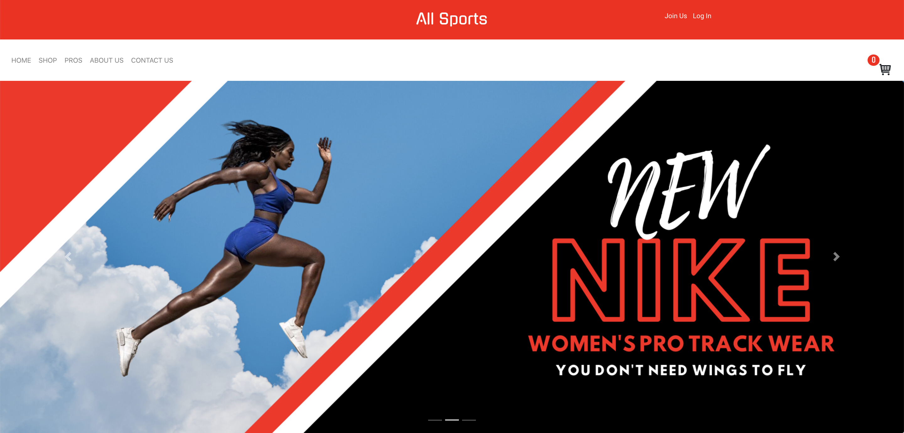

# ALLSPORTS   
 
# E-Commerce Platform

## Challenges I Faced? 

There were so many challenges with this project it's almost difficult to begin. For starters our team dynamic wasn't the most in sync, there was trouble divvying up the work, and frankly we all were brand new to the work life changes we had to make. Initially we had an MVP that had far too many features to even to think of creating in three weeks. Not to mention smack dab in the middle of all of this, the whole world went into quarantine forcing our team to learn how to work remotely, and there were several changes to design and functionality throughout the process. Keeping things efficient, clean, and organized in the beginning proved troublesome. 

## How Did I Over Come Those Challenges?

Repetition. Asking for help. Our team dynamic began to improve when we spent more time talking among ourselves and getting to know each other. Understanding somebody's style of communication helps you avoid misinterpreting them. Asking the right questions ensures that the proper task are being addressed and worked on. I've learned with working remotely you must treat it like any regular job do you drive into. Getting up early, exercising, eating breakfast, and giving my time to think about the events that are to transpire throughout the day really helps me in life and in coding. To keep things clean, efficient and organized we decided to create a checklist in the issues tab within the main project repository, this way we could avoid doing the same work twice. Because the The main project repositories issues tab was already being used I decided to create a new repository to store all our data assets in that repositories issues tab (see: "https://github.com/JustinBurrowsDev/allsports-react-redux-nodejs-express-mysql"). If you would like to see the software demo for the Allsports please see: "https://www.youtube.com/watch?v=CmTqXUeLH8k&feature=youtu.be"

## What Did I Learn? 

* How to work remotely with the team
* How to find and use NPM modules 
* How to make sure the database is connected to the application
* Reinforce CSS skills
* Expanded JavaScript knowledge
* How to debug using the Google Chrome consule
* How to merge branches on GitHub
* How to communicate with a team through pull request
* How to find and use design vectors 
* When and how to ask for feedback and assistance
* How to resolve design and functionality conflicts 
* How to find, research, and implement unknown concepts

